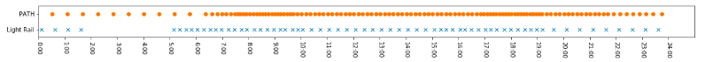
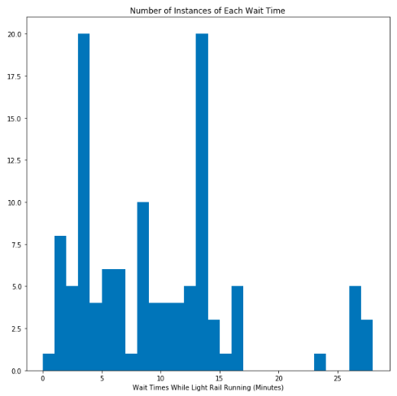
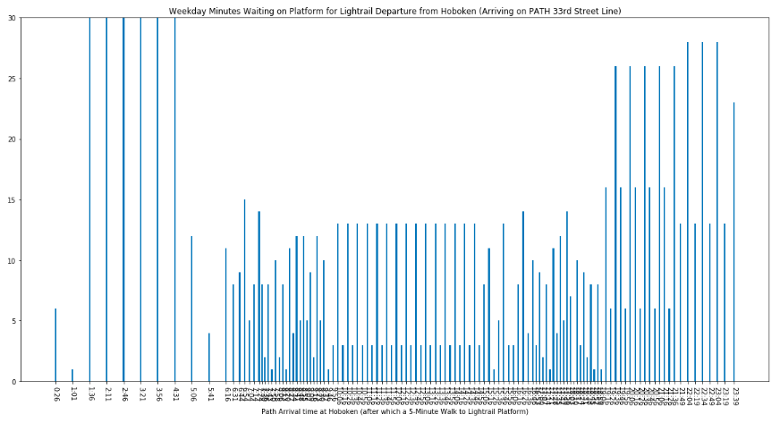

## PATH and Hudson-Bergen Light Rail Connections: Minding the Gap

### Current Situation

Hudson-Bergen Light Rail (HBLR), first opened in the year 2000, had around 54,500 boardings per weekday in the fourth quarter of 2017 according to Wikipedia, making it the 18th busiest in North America.  A [2009 New Jersey government study](https://www.nj.gov/transportation/refdata/research/reports/FHWA-NJ-2009-004.pdf) showed that about 25% of riders who boarded HBLR were heading to New York, 85% of these via PATH.  Given real-estate trends in Hoboken and Jersey City since 2009 (higher prices, many residential towers built, especially near the Exchange Place and Newport PATH stations that connect to HBLR), I assume the share of commuters (or reverse commuters) to/from New York has only increased, meaning at least 11,500 daily weekday connections between PATH and HBLR.

How long are riders waiting between the PATH and HBLR legs of their trips?  It depends mainly on three things, which HBLR and PATH lines are involved in a trip, whether it's the weekend and the time of day.  To see this first focused on an example case: a weekday journey from anywhere on the PATH line coming from 33rd Street Station in Manhattan to Hoboken and then going on to anywhere on the HBLR Tonelle Ave line.

For now I have not used APIs provided by NJ Transit (operator of HBLR) or Port Authority of New York and New Jersey (operator of PATH), but that will be key if all lines are to be included or an online app is to be developed.

I would be ideal if riders could move from PATH to HBLR platforms at Hoboken (a 3-5 minute walk) and then depart on HBLR within a few minutes, but this is impossible as PATH usually runs much more frequently than HBLR (at certain hours three times more) and does not shut down between about 2:00AM and 5:00am:

Notice that deviations mostly occur after 7:15pm, when HBLR trains are scarce, and 5:00-6:15am, when there are three times more HBLR trains departing than PATH trains arriving.

Given that it takes up to 5 minutes to move from PATH to HBLR platforms, for most of the day when both PATH and HBRL are running, mean wait times are just over 9 minutes with standard deviation of just under 7 minutes.  However, the distribution is far from normal:

### Recommendation

The nine times riders must wait 23-28 minutes for an HBLR departure are all after 7:15pm, when there are generally 2-3 PATH arrivals per HBLR departure.  For example, riders arriving on PATH trains at 7:16PM and 7:26PM must both board the HBLR train at 7:37PM, the former waiting 16 minutes and the latter 6 on the platform (after their 5-minute walk between platforms).  The next HBLR train is not until 8:07, serving riders from three PATH arrivals (7:36PM, 7:46PM and 7:56PM), the first group of whom must wait 26 minutes on the platform (followed by 16 and 6 minutes for the next two PATH trains).

7:36PM is still very much part of the evening rush hour, and many commuters would be better served by more HBLR departures from Hoboken 7:00-9:00PM.  A 26-minute wait between PATH and HBLR legs could easily push a commute to over an hour (not including time getting to the PATH in Manhattan and walking time from HBLR to home in New Jersey).  HBLR departures from Hoboken 5:00-6:15 could be reduced slightly to compensate if necessary.
